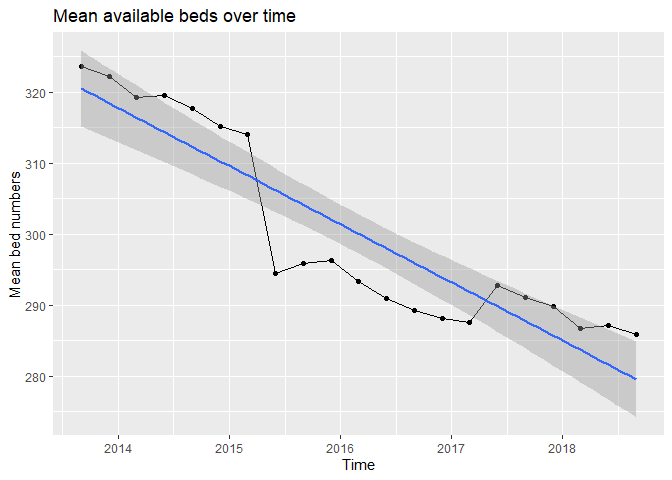

Intro to R - naming objects, and assignments
================
A.Kirkham
10/02/2020

# Introduction

This is a continuation / supplement to the previous guide to wrangling
data uing the dplyr() \[dee-ply-r\] package (and also ggplot).

This guide to naming objects has been built following slides from the
NHS-R community at:  
<https://github.com/nhs-r-community/intro_r/blob/master/06-workshopv2_objects.pdf>

The below code and output are generated from following these slides.

All of the resources used here are found on the NHS-R Community Github
pages: <https://github.com/nhs-r-community/intro_r>

**Now follows a workthrough of the slides.**

Note that this code will not work without the below being run first (if
you have cleared down the environment):

``` r
library(tidyverse)
library(readr)
beds_data <- read_csv("beds_data.csv", col_types = cols(date = col_date(format = "%d/%m/%Y")), 
                      skip = 3)
beds_data
```

    ## # A tibble: 4,558 x 5
    ##    date       org_code org_name                              beds_av occ_av
    ##    <date>     <chr>    <chr>                                   <dbl>  <dbl>
    ##  1 2013-09-01 R1A      Worcestershire Health And Care            129    117
    ##  2 2013-09-01 R1C      Solent                                    105     82
    ##  3 2013-09-01 R1E      Staffordshire And Stoke On Trent Par~      NA     NA
    ##  4 2013-09-01 R1F      Isle Of Wight                              54     42
    ##  5 2013-09-01 R1H      Barts Health                               NA     NA
    ##  6 2013-09-01 R1J      Gloucestershire Care Services              NA     NA
    ##  7 2013-09-01 RA2      Royal Surrey County Hospital               NA     NA
    ##  8 2013-09-01 RA3      Weston Area Health                         NA     NA
    ##  9 2013-09-01 RA4      Yeovil District Hospital                   NA     NA
    ## 10 2013-09-01 RA7      University Hospitals Bristol               NA     NA
    ## # ... with 4,548 more rows

Revisiting the dplyr slides we produced the following code:

``` r
beds_data %>%
  group_by(date) %>%
  summarise(
    mean_beds = mean(beds_av, na.rm = T)
  ) %>%
  ungroup()
```

    ## # A tibble: 21 x 2
    ##    date       mean_beds
    ##    <date>         <dbl>
    ##  1 2013-09-01      324.
    ##  2 2013-12-01      322.
    ##  3 2014-03-01      319.
    ##  4 2014-06-01      320.
    ##  5 2014-09-01      318.
    ##  6 2014-12-01      315.
    ##  7 2015-03-01      314.
    ##  8 2015-06-01      294.
    ##  9 2015-09-01      296.
    ## 10 2015-12-01      296.
    ## # ... with 11 more rows

All fine and good, but something to consider is that the **output =
object = new data frame**.

## Next step: Visualise

Often we want to actually visualise the output, not just look at it in a
block of values in R.

### Piece it together

``` r
beds_data %>%
  group_by(date) %>%
  summarise(
    mean_beds = mean(beds_av, na.rm = T)
  ) %>%
  ungroup()
```

Then… take this new output/object/data frame into: `ggplot(data = [this
new data])`

So, we could do something like:

``` r
ggplot(data = beds_data %>%
         group_by(date)%>%
         summarise(
           mean_beds = mean(beds_av, na.rm = T))
       ) +
  geom...
```

**But it is often better to keep wrangling separate.**.

### And it is always better to:

**Keep your code** as **readable** as possible.

**The solution is to name your code elements.**

We can take all of the code:

``` r
beds_data %>%
  group_by(date) %>%
  summarise(
    mean_beds = mean(beds_av, na.rm = T)
  ) %>%
  ungroup()
```

and assign a **name** to it.

### Good object names

Naming something is tricky. I always tend to name things “Gerald”, I
don’t know why (AK).  
However, good object names are:

  - Descriptive;
  - Short(ish);
  - Consistent with other names.

So something like `beds_ts` may work well in this instance.

Although this is being done within tidyverse assignment of code to a
name/variable is the same as in all R scripting “\<-”.  
*Alternatively use the key combination of alt-.*

This is known as the assignment operator.

As such, we can associate all of the previous code to a single name.
This means that we can repeatedly call it, we don’t have to repeatedly
type it out, and most importantly we keep all wrangling separate and
consistent.

``` r
beds_ts <- beds_data %>%
            group_by(date) %>%
            summarise(
              mean_beds = mean(beds_av, na.rm = T)
            ) %>%
            ungroup()
```

If we now call `beds_ts` we get the output expected:

``` r
beds_ts
```

    ## # A tibble: 21 x 2
    ##    date       mean_beds
    ##    <date>         <dbl>
    ##  1 2013-09-01      324.
    ##  2 2013-12-01      322.
    ##  3 2014-03-01      319.
    ##  4 2014-06-01      320.
    ##  5 2014-09-01      318.
    ##  6 2014-12-01      315.
    ##  7 2015-03-01      314.
    ##  8 2015-06-01      294.
    ##  9 2015-09-01      296.
    ## 10 2015-12-01      296.
    ## # ... with 11 more rows

You will find that `beds_ts` is now also in the Environment pane - it
has stored this output as a data frame.

## Returning to the plot

You will recall that the whole reason behind assigning names to this
code was to keep it clean and also make plotting more efficient.  
As a result of us assigning the name `beds_ts` to the code segment we
can replace:

``` r
ggplot(data = beds_data %>%
         group_by(date)%>%
         summarise(
           mean_beds = mean(beds_av, na.rm = T))
       ) +
  geom...
```

With this:

``` r
ggplot(data = beds_ts) +
  geom_...(aes(x = ..., y = ...))
```

## Task: Plot the trend in mean available beds.

Slide says: “You may require `ggplot()` plus `+` the following layers:”

``` r
geom_line(aes(..., ...)) +
geom_point(...(..., ...)) +
ylim(..., ...) # To get help with this (or any) function type ?ylim
```

I’m not sure why you’d want `ylim` here (AK). To me, the boundaries look
reasonable - maybe they wanted to cut off the earlier entries which were
substantially greater? I’m not sure; probably something that would be
more apparent in the actual sessions.

``` r
beds_ts_plot <- ggplot(data = beds_ts) +
  geom_line(aes(x = date, y = mean_beds)) +
  geom_point(aes(x = date, y = mean_beds)) +
  geom_smooth(aes(x = date, y = mean_beds), method = "lm") +
  labs(
    title = "Mean available beds over time",
    x = "Time",
    y = "Mean bed numbers"
  )

beds_ts_plot
```

<!-- -->
