NHS- Community: Introduction to ggplot
================
A.Kirkham
10/02/2020

# Introduction

This is a guide to producing plots in R using the ggplot() package.

This guide to ggplot() has been built following slides from the NHS-R
community at:  
<https://github.com/nhs-r-community/intro_r/blob/master/04-workshopv2_ggplot.pdf>

The slides really are excellent and I recommend a read of these. The
below code and output are generated from following these slides.

All of the resources used here are found on the NHS-R Community Github
pages: <https://github.com/nhs-r-community/intro_r>

**Now follows a workthrough of the slides.**

Load the relevant libraries:

``` r
library(tidyverse)
```

Import the dataset.  
In this instance use Environment \> Import Dataset \> From text (readr)
\[for csv\]:  
Look at the data in the import window: does it look reasonable? Do any
changes need to be made? Headers on row 1?  
If so, copy out the read\_csv line and paste below.

``` r
capacity_ae <- read_csv("capacity_ae.csv")
```

### First task: Explore the standard challenge for the NHS - Pressures in A\&E.

The quintessential challenge within the NHS…  
Data: Capacity in A\&E  
The dataset shows the changes in capacity of A\&E departments from 2017
to 2018.

The object capacity\_ae is a dataframe (or a ‘tibble’ in tidyverse)

View the dataset/tibble.  
Fields include: the site, number of attendances, staff\_increase (did \#
staff increase between 2017 and 2018?), dcubicles & dwait (difference in
average from 2017 to 2018).

Load the dataset and take a look at the top 10 rows:

``` r
capacity_ae
```

    ## # A tibble: 68 x 5
    ##     site attendance2018 staff_increase dcubicles   dwait
    ##    <dbl>          <dbl> <lgl>              <dbl>   <dbl>
    ##  1     1          81600 TRUE                  50 -59.9  
    ##  2     2         114600 FALSE                 49 -32.8  
    ##  3     3          83400 FALSE                 47   3.39 
    ##  4     4          80600 FALSE                 47 -22.1  
    ##  5     5         106000 FALSE                 45  -2.42 
    ##  6     6          96600 FALSE                 42 -40.5  
    ##  7     7         112200 TRUE                  37   3.54 
    ##  8     8          87600 FALSE                 37  22.7  
    ##  9     9          88000 FALSE                 31  -0.709
    ## 10    10         138200 FALSE                 29   4.45 
    ## # ... with 58 more rows

### Question: Is a change in the number of cubicles available in A\&E associated with a change in the length of attendance?

Always start with ggplot, then specify the dataset.  
Next add layers with a +

Decide what kind of data you want to show (geometric object): a point,
bar, line? (always geom\_ before it)

Next, what kind of aesthetics do we give to the geom? (position x, y,
colour, size)

In the basic example plot below these are all set to default
(non-declared)

``` r
ggplot(data = capacity_ae) +
  geom_point(aes(x = dcubicles, y = dwait))
```

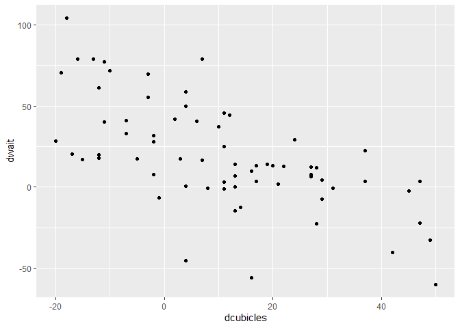<!-- -->

#### Functions:

ggplot(), geom\_point(), and aes() are all functions.  
Running a function does something; functions are given zero or more
inputs (arguments).  
Arguments of a function are separated by a comma.

You can explicitly name arguments, or not provided the arguments are in
the correct order: `ggplot(data = capacity_ae) == ggplot(capacity_ae)`

In the graph we’ve just put together we declared the input dataset, and
two aes arguments.  
Within the aes *x* goes first, *y* goes second.

``` r
ggplot(data = capacity_ae) +
   geom_point(aes(x = dcubicles, y = dwait))
```

Therefore the above is the same as:

``` r
ggplot(capacity_ae) +
   geom_point(aes(dcubicles, dwait))
```

*Importantly, both produce the same output. It is up to the user which
option to go with.*

There are various geoms available, and we describe plots in terms of the
geom used:  
**geom\_bar(); geom\_line(); geom\_boxplot(); geom\_histogram()**

We can also add more than one geom in a plot, *again using a + to add
another layer*.

In the below we’ll use the same graph as ^ but add a geom\_smooth layer
to help identify patterns:

``` r
ggplot(data = capacity_ae) +
  geom_point(aes(x = dcubicles, y = dwait)) +
  geom_smooth(aes(x = dcubicles, y = dwait))
```

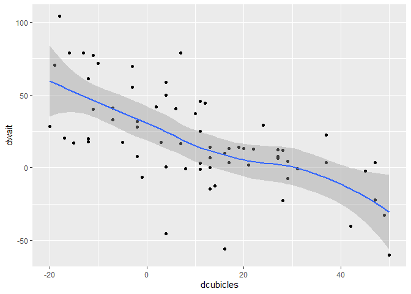<!-- -->

The above is fine, but we probably want to add a linear fit to the
smooth, rather than a non-linear fit:

``` r
ggplot(data = capacity_ae) +
  geom_point(aes(x = dcubicles, y = dwait)) +
  geom_smooth(aes(x = dcubicles, y = dwait), method = "lm")
```

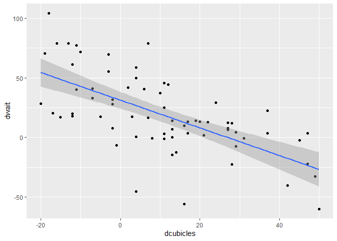<!-- -->

#### Outliers?

Looking at the graph there are a couple of datapoints low down on the y
axis compared to the others.

What’s the deal with these?

Hypothesis: The two sites have seen staffing increases.  
We can map point colour to the staff increase variable to find out.
Therefore, every point will be coloured according to the value of
staff\_increase.

**Change an attribute within/outside of variables**  
Put an argument *inside* aes() if you want a visual attribute to change
with different values of a variable:

``` r
ggplot(data = capacity_ae) +
  geom_point(aes(x = dcubicles, y = dwait, colour = staff_increase))
```

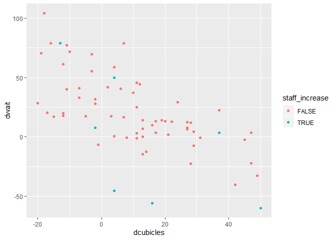<!-- -->

Put an argument *outside* aes() if you want a visual attribute to be
applied across a whole plot:

``` r
ggplot(data = capacity_ae) +
  geom_point(aes(x = dcubicles, y = dwait), colour = "red")
```

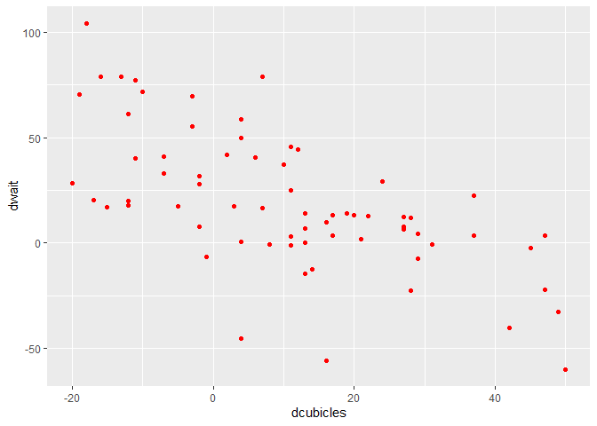<!-- -->

Or…

``` r
ggplot(data = capacity_ae) +
  geom_point(aes(x = dcubicles, y = dwait), size = 4)
```

Or even…

``` r
ggplot(data = capacity_ae) +
  geom_point(aes(x = dcubicles, y = dwait), colour = "red", size = 4)
```

Or perhaps… both inside and outside?

``` r
ggplot(data = capacity_ae) +
  geom_point(aes(x = dcubicles, y = dwait, colour = staff_increase), size = 4)
```

And then also apply the smoothing too…

``` r
ggplot(data = capacity_ae) +
  geom_point(aes(x = dcubicles, y = dwait, colour = staff_increase), size = 2) +
  geom_smooth(aes(x = dcubicles, y = dwait),
              method = "lm") # Fit a linear model rather than a non-linear
```

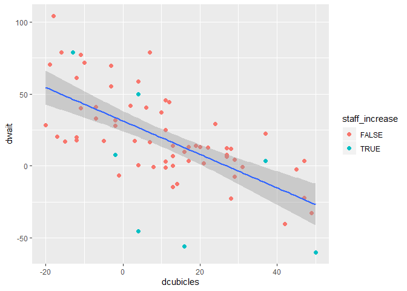<!-- -->

#### Facet Wrap

Another way to visualise the relationship between multiple variables is
with a facet\_wrap() layer:  
facet\_wrap() is used for categorical variables

``` r
ggplot(data = capacity_ae) +
  geom_point(aes(dcubicles, dwait)) +
  # Then tell facet_wrap() you want a panel for each category of [staff_increase]
  facet_wrap(vars(staff_increase))
```

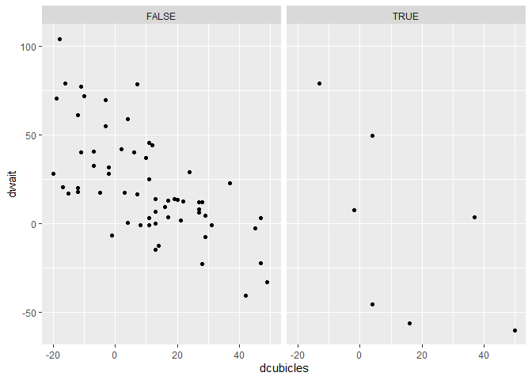<!-- -->

The above presents each panel with a vertical split, if you want it
splitting horizontally add an extra argument (number of columns = 1):

``` r
ggplot(data = capacity_ae) +
  geom_point(aes(x = dcubicles, y = dwait)) +
  facet_wrap(vars(staff_increase), ncol = 1)
```

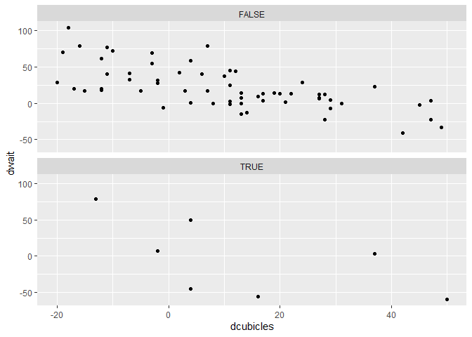<!-- -->

### Further demonstrations of other types of geom:

#### How are wait values distributed? - Histogram

``` r
ggplot(data = capacity_ae) +
  geom_histogram(aes(dwait))
```

    ## `stat_bin()` using `bins = 30`. Pick better value with `binwidth`.

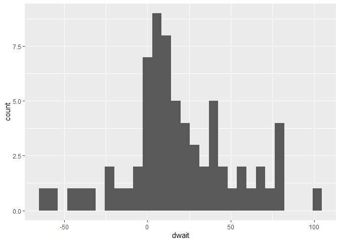<!-- -->

R advises that there are 30 bins using the above method, and suggests
that we set a value for the number of bins instead (binwidth):

``` r
ggplot(data = capacity_ae) +
  geom_histogram(aes(dwait),
                 binwidth = 10)
```

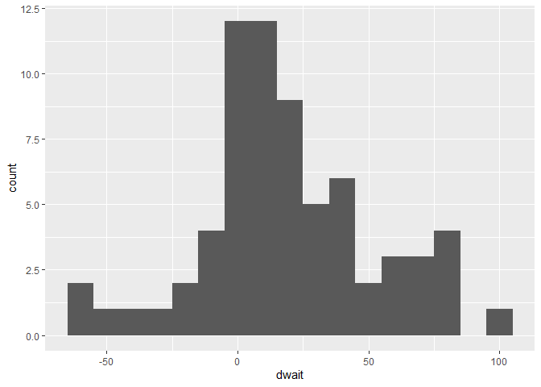<!-- -->

#### Number of attendances by site? - Barplot

``` r
ggplot(data = capacity_ae) +
  geom_col(aes(x = site, 
               y = attendance2018))
```

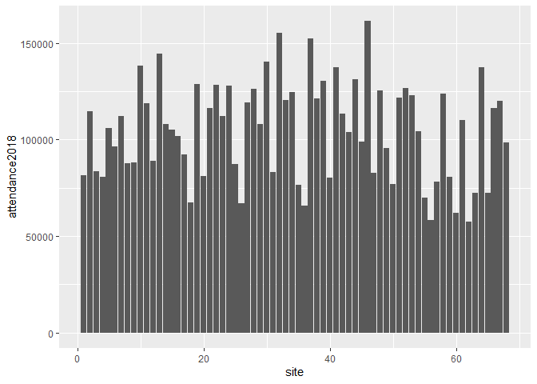<!-- -->

Again, the above is fine, but how about we reorder site by
attendances?  
This will make the graph easier to comprehend.

``` r
ggplot(data = capacity_ae) +
  geom_col(aes(x = reorder(site, attendance2018), # We are still specifying site as x, just reordering them.
               y = attendance2018))
```

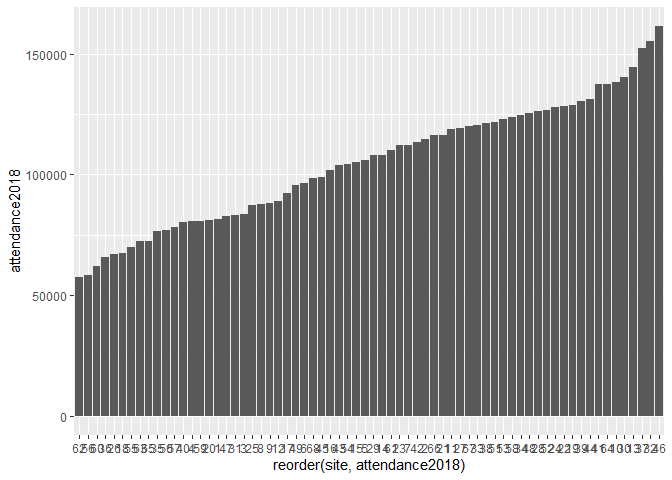<!-- -->

#### Distribution of “wait” for each value of staff level? - Boxplot

``` r
ggplot(data = capacity_ae) +
  geom_boxplot(aes(staff_increase, dwait))
```

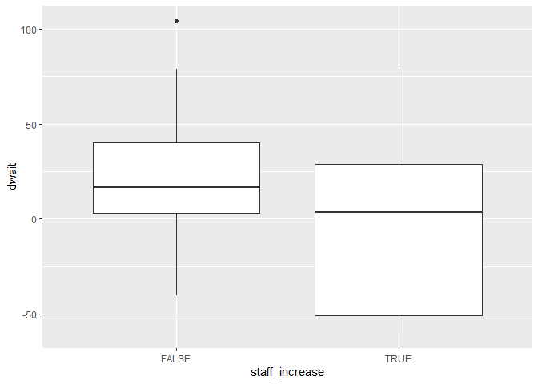<!-- -->

### Labels on plots

These plots are good but we need to add some labels to aid clarity.

**Add extra layer for labels:**

``` r
ggplot(data = capacity_ae) +
  geom_boxplot(aes(staff_increase, dwait)) +
  labs(
    title = "Do changes in staffing affects wait times?",
    x = "Is there a staff increase?",
    y = "Waiting time"
  )
```

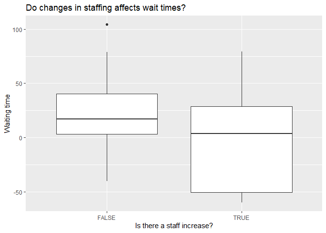<!-- -->

### Saving the output

Finally, we may want to save the graph for use elsewhere. We’ll use the
same graph, but add another layer:

By default ggsave() will save a plot using the same dimensions as the
plot window.

You can adjust these, e.g.:  
`ggsave(plot_name.png, units = "cm", height = 10, width = 8)`

``` r
ggplot(data = capacity_ae) +
  geom_boxplot(aes(staff_increase, dwait)) +
  labs(
    title = "Do changes in staffing affects wait times?",
    x = "Is there a staff increase?",
    y = "Waiting time"
  ) +
  ggsave("ggplot_intro_example_save.png")
```

<!-- -->

### Final point: Duplications

One final point. Earlier we detailed the addition of a geom\_smooth() to
help identify patterns:

``` r
ggplot(data = capacity_ae) +
  geom_point(aes(x = dcubicles, y = dwait)) +
  geom_smooth(aes(x = dcubicles, y = dwait), method = "lm")
```

<!-- -->

However, both geom\_point() and geom\_smooth() use the exact same
arguments.  
No problems but duplication of code…

There is a way around this when layering geoms.  
To avoid duplication we can pass the common local aes() arguments to
ggplot() to make them global. Doing so means the same output but without
the duplication.

Recall that arguments must be in the expected order to function.  
In the ggplot() function, aes() is the standard second argument.

``` r
ggplot(data = capacity_ae, aes(x = dcubicles, y = dwait)) +
  geom_point() +
  geom_smooth(method = "lm")
```
